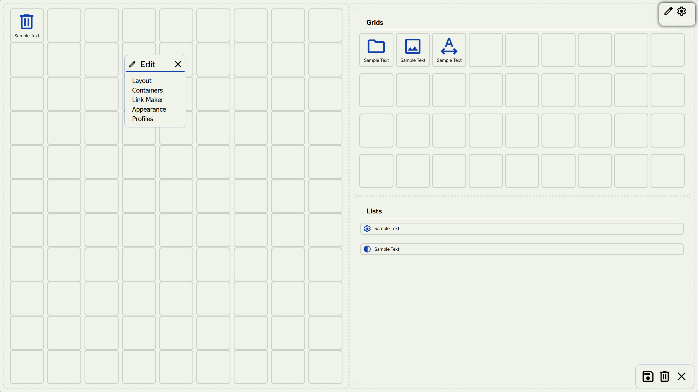
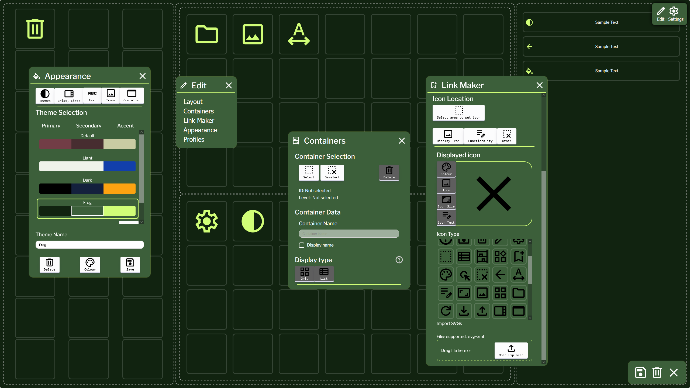
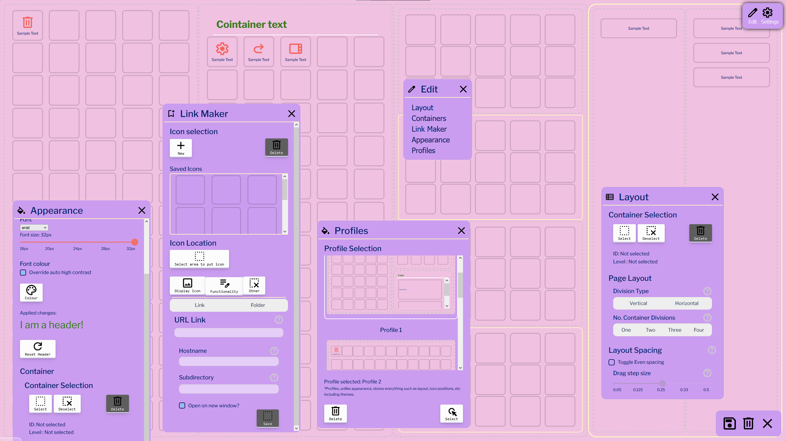

<div align="center">
<h3 align="center">Homepage Plus</h3>

  <p align="center">
    A user based customizable homepage
    <br />
    <a href="https://github.com/Astralye/Homepage-Plus"><strong>Explore the docs»</strong></a>
    <br />
    <br />
    <a href="https://astralye.github.io/Homepage-Plus/">View Demo</a>
    .
    <a href="https://github.com/Astralye/Homepage-Plus/issues/new?labels=bug">Report Bug</a>
    ·
    <a href="https://github.com/Astralye/Homepage-Plus/issues/new?labels=enhancement">Request Feature</a>
  </p>
</div>
<details>
  <summary>Table of Contents</summary>
  <ol>
    <li>
      <a href="#about-the-project">About The Project</a>
      <ul>
        <li><a href="#built-with">Built With</a></li>
      </ul>
    </li>
    <li>
      <a href="#getting-started">Getting Started</a>
      <ul>
        <li><a href="#prerequisites">Prerequisites</a></li>
        <li><a href="#installation">Installation</a></li>
      </ul>
    </li>
    <li><a href="#usage">Usage</a></li>
    <li><a href="#screenshots">Screenshots</a></li>
    <li><a href="#license">License</a></li>
    <li><a href="#contact">Contact</a></li>
  </ol>
</details>

## About the Project




The internet is unfathomably huge. However, It can be hard to keep track of important websites needed as well as all useful and relevant pages we might need. The idea came from a disorganised bookmarks and also non-customizable homepages that search engines use. In Firefox and Chrome (others I haven't confirmed) you are able to set a website to a homepage. However, I cannot seem to find any extensions or websites that can help personalize and organize internet usage.

The reasoning behind this project is more personal than anything. I find that it is tedious having to scour the internet for certain things and then get sub-par results. Having the user be able to create and organize their own personal 'page' to then surf the internet will help me (and perhaps others), to have a more streamlined internet usage.

The main goal of this is to push users to create and customize a personal home-page for their internet usage. Therefore, the point of this is to help organize and as such, is a productivity tool.

I have discussed this idea with others, and they have agreed with its potential usefulness. However, whether it is just me, the creator, who would actually find this useful, or other power users who would find benefit, I am unsure of the widespread appeal of this app. 

As such, this project has a specific audience. Those who use the internet fairly often (outside of social media), and would like to organize browser and internet surfing. Although this idea may be widely spread, the implementation of setting up and using local webpages rather than a dedicated app would most likely cause non-programmer or technical users to not use this application. Since this is a personal project, I would not expect this to grow large enough for this to be a problem.

## Built with

* [![Vue][Vue.js]][Vue-url]

[Vue.js]: https://img.shields.io/badge/Vue.js-35495E?style=for-the-badge&logo=vuedotjs&logoColor=4FC08D
[Vue-url]: https://vuejs.org/

## Getting Started

### Prerequisites
* npm
  ```sh
  npm install npm@latest -g
  ```
### Installation
1. Clone the repo
   ```sh
   git clone https://github.com/Astralye/Homepage-Plus.git
   ```
2. Install NPM packages
   ```sh
   npm install
   ```
3. Change git remote url to avoid accidental pushes to base project
   ```sh
   git remote set-url origin Astralye/Homepage-Plus
   git remote -v # confirm the changes
   ```
4. Change directory*
   ```sh
   cd Homepage-plus/client/testproject
   ```

This was initially built with the idea of using a daemon server and service to run the page. I found out later that I can deploy to github pages, and so will need to change directory to get to working files.

# Usage
## Initial Start
On load, the page will be empty with two buttons at the top right:
1. Edit
2. Settings
Clicking will open a window of the respective button.
## Edit
When the edit button is clicked, it will toggle edit mode.

While in this mode, the user is able to modify any appearance, layout, etc as they see fit. 

To exit the edit mode, click the x or re-click the edit button.
A window will appear giving 5 options to change:
1. Layout
2. Containers
3. Appearance
4. Profiles
### Edit Mode
In edit mode, clicking on the icons will not trigger the link to operate.
The user will able to select icons to drag and move around via drag and drop functionality.

Multi-select is implemented. Click and drag over an area ( Not starting on an icon ), to display a selection box. This uses collision detection to determine if an item, grid icon or list icon was selected. Clicking anywhere in the space will cancel the multi-select.

**Note:** A context menu is available on right click, however, this is non-functional and only for display.

Ctrl + Click to add to multiselection
Shift + Click to add all from last selection to multiselection.
### Layout
The layout window is used to divide the page up into sections, or **containers**.

The user is able to select a container by initializing a select, and clicking the container. If the user does not want to select anymore, they cant deselect.

**Note:** Implementation for deletion was partially added, but contains bugs. Using this will crash the page.

The page starts off with a base container, 0A, and the user can create as many containers within containers. These can range from 1-4 divisions, with each container being able to divide vertical or horizontally.

**Note:** Past 3 or 4 recursive containers, it may be impractical to use due to the size getting smaller per container added. 

Normally, the divisions are calculated via fraction units, ( fr values) spaced evenly between one other. The user can change the ratio / fraction a container takes space, allowing the change of how much the ratio changes.

To change the ratio, drag the sides of the container (left/right for vertical and up/down for horizontal divisions) to the next position.

**Note:** If the ratios are unchanged, they will cause re-render bugs. Toggle even spacing to reset / when needing even spacing.
### Containers
The Container tab refers to how a specific container displays content within it.

Like layout, the user can choose which container to modify.

Users are able to disaplay a caption or name for the container selected.
This has to be enabled first, and the user can type it out.

A container can display content in two ways. These are changed via clicking the respective tab.
5. Grids
6. Lists
#### Grids
Grids dimensions are calculated item sizes. 
Items put into grids will be automatically placed left to right, top to bottom.

The user can override this via changing directions or changing to free mode.

Free mode allows icons to be placed anywhere.
**Note:** If the dimensions are changed, the position of the icon will stay in the same axes.
#### Lists
Lists will display items top to bottom, with each spanning the whole width. Any excess items within the list will overflow via scrolling content of that container.

Position of text can be modified.
### Link Maker
Icons can be created within the link maker.
The user can add, select and delete icons.
All saved icons within link maker will be stored and wont be deleted on page refresh.

Icons can be modified if they are selected, either via link maker or clicked in the edit area.

**Note:** If multi-selection, the first icon will be modified
#### Display Icon
This tab will affect the appearance of the icon.

**Note:** Changes to colour, size, text size will not be modified if the setting is set to global in appearance. It will also only affect the selected icon.

The user can choose icons that are pre-downloaded, or alternatively can import their own SVGs.

Importing SVGs will need to be saved to ensure data to be remained on reload, profiles, imports and exports.
#### Functionality
**Note:** Folder is not implemented.
**Note:** Links always open on new windows.

The user is able to set the URL of the page they choose when the icon is clicked on, in normal mode.

The URL can be directly inputted in, or the individual parts of the page can be put in.
### Appearance
Appearance affects the CSS of the page. The user can customize how their page looks.

The options, except themes can be toggled to apply global settings, i.e sitewide changes than specific areas. This applies the data to the component.
#### Themes
The site is loaded with the default theme. The site also provides two other themes that aren't modifiable. Clicking on a theme gives a preview, but is not saved.

The site uses three main colours to display content.
Primary is used for the main background.
Secondary is the colour of the windows
Tertiary / accent is used for contrast ie for icons or dividers.

Themes can be added, deleted and renamed.
To change the colour of a new theme, click on the specific colour to select and open the colour window at the bottom.

The theme **MUST** be saved here on this menu. If the window closes or refreshed, the theme is not saved.
#### Grids and Lists
Here the user can modify
- Toggle icon text on grids
- Icon size
- Grid size ( Affects dimension of the grid layout )

- Toggle icon image on lists
- Toggle list divider
- Modify item height
- Modify margin between items

To revert any changes click the reset button.
#### Text
This tab affects the text of the entire page, with colour affecting windows too.

**Note:** Font type does not change.
**Note:** text background does not function

Font colour contrast is calculated based on secondary colour. This can be disabled to use a different colour. 
**Note:** This will not change when changing themes. It may make text unreadable if not changed.
#### Icons
Icon colour can be set globally as a tertiary colour ( default ) or can be overrided with a different colour.
**Note:** Just like colour text, this may make the icon hard to see if themes change.
#### Container
This tab affects container header and borders
#### Header
**Note:** Changing font is not implemented.

The user can modify header size, and colour. Overriding the colour will take precedence after text colour. When disabled, it will revert back. 
#### Borders
The user is able to select a container to apply borders.
In edit mode, the outline of the container is present but does not show outside of edit menu.
The border thickness and radius is able to be adjusted.
### Profiles
A profile consists of the entire data used for a specified layout, including any icons, positions, appearance settings, layouts and containers.

The user is given a default, empty profile to use. The user can add, select, add and rename profiles. Each profile will provide a small preview window.

The selected profile is what is currently rendered.
**Note:** When deleting profiles, it has to be selected, shown via the profiles selected, not the border, as it has to be loaded.
**Note:** Deleting profiles will be saved immediately, to trigger a re-render.
## Settings
**Note:** Window will be automatically enabled for larger windows, and sidebars for tablet sizes and fullscreen for mobile devices.
### Imports
Imports will be read from a JSON file.
A parser will check for correct data type.
On success, it will preview any data that is rendered, and will ask for confirmation to load the data.

This data is not saved locally, and must be saved if wanted to save changes.
![[importing.png]]
### Exports
The user is able to export data.
This is saved on the users device as a JSON file.
**Note:** It is not recommended to modify any of the data in the export file as it may become unreadable to the import parser.

## Screenshots


## License
This project is licensed under the GNU General Public License v3.0. See the [License](LICENSE.md) file for details.

